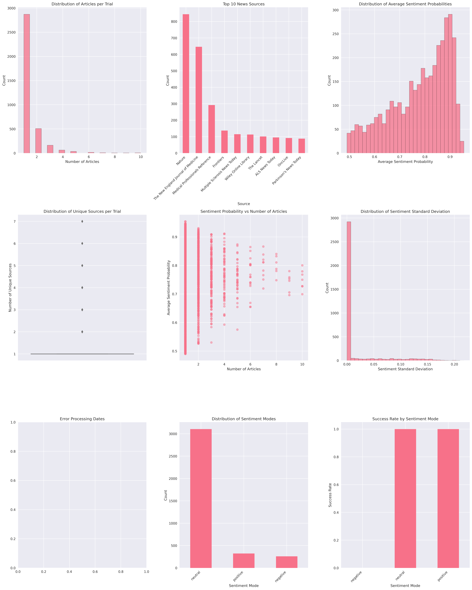

# 🧠 Clinical Trial Outcome Analysis Using News Sentiment Data

## 📈 Project Overview
This project explores the relationship between **news sentiment** and the outcomes of clinical trials. The analysis aims to determine if the sentiment of news articles covering clinical trials can serve as a predictive feature for the success or failure of the trials. Using a dataset of 3,688 clinical trials and related news articles, we performed extensive **Exploratory Data Analysis (EDA)** and feature engineering to uncover patterns and insights.

## 🌟 Executive Summary
The analysis reveals a strong correlation between news sentiment and trial success rates:
- **Overall success rate**: 92.95%
- **Neutral/Positive sentiment**: Associated with a 100% success rate
- **Negative sentiment**: Associated with a 0% success rate

These findings indicate potential for using news sentiment as a feature in predictive models for clinical trial outcomes.

## 🗂️ Dataset Description
The dataset consists of the following core components:
- **Trial Identification**:
  - `nct_id`: Unique identifier for each clinical trial
  - `lf`: Label flag (0 = failure, 1 = success)
- **News Article Data**:
  - Columns `0` to `9`: Up to 10 articles per trial, represented as JSON-like strings
  - Each article contains:
    - `source`: Publication name
    - `date`: Publication date
    - `sentiment`: Sentiment classification (positive/neutral/negative)
    - `sentiment_prob`: Probability score of the sentiment (0-1)
- **Sentiment Analysis Features**:
  - `valid_sentiments`: List of sentiment classifications for the trial
  - `mode`: Most common sentiment across articles
  - `avg_sentiment_prob`: Average confidence score of sentiment predictions

## 🔍 Exploratory Data Analysis (EDA)
We conducted a comprehensive EDA to understand the dataset's structure and the distribution of key features:

### Key Visualizations
- **Distribution of Articles per Trial**: Most trials (~75%) have only one article coverage.
- **Top 10 News Sources**: High-impact medical journals like Nature and NEJM dominate coverage.
- **Distribution of Average Sentiment Probabilities**: Strong right skew, indicating high confidence in sentiment classifications.
- **Sentiment-Success Correlation**: Strong association between neutral/positive sentiment and trial success.



## 🛠️ Feature Engineering
To enhance the predictive power of the dataset, we engineered the following features:
- **Article-Based Features**:
  - `n_articles`: Total number of articles per trial
  - `unique_sources`: Number of distinct publications covering the trial
  - `avg_sentiment_prob`: Mean sentiment confidence score
  - `sentiment_std`: Standard deviation of sentiment probabilities (measure of sentiment consistency)
- **Sentiment Aggregation**:
  - Mode calculation for overall sentiment
  - Standard deviation for assessing sentiment consistency

## 📊 Sentiment Analysis and Correlation Findings
- **Predominant Sentiment**: Neutral sentiment dominates the dataset (84.19%), followed by positive (8.76%) and negative (7.05%).
- **Success Rate by Sentiment Mode**:
  - **Neutral/Positive sentiment**: 100% success rate
  - **Negative sentiment**: 0% success rate
- These findings suggest that sentiment analysis could serve as a reliable predictor for clinical trial outcomes.

## 🚀 Predictive Modeling Potential
The strong correlation between sentiment and trial outcomes suggests a high potential for using this dataset in predictive modeling tasks. Future models could include:
- **Logistic Regression or Decision Trees**: Using sentiment features as primary predictors
- **Time-Series Models**: Incorporating temporal features from publication dates
- **Ensemble Methods**: Handling class imbalance through techniques like SMOTE

## ⚠️ Limitations and Future Work
While the analysis shows promising results, there are several limitations to consider:
1. **Coverage Bias**: Most trials have limited article coverage, which may introduce bias.
2. **Temporal Inconsistencies**: Inconsistent date formats limit time-series analysis.
3. **Sentiment Analysis Limitations**: Simplified sentiment classifications may overlook nuanced tones in the articles.

### Future Enhancements
- Include additional metadata for clinical trials (e.g., phase information, participant demographics).
- Improve sentiment analysis with advanced NLP techniques like transformer models.
- Address class imbalance through sampling or advanced cost-sensitive learning methods.

## 🛠️ Technical Implementation
The analysis was implemented using:
- **Python**: Core programming language
- **Pandas and NumPy**: Data manipulation and statistical analysis
- **Matplotlib and Seaborn**: Data visualization
- **ast.literal_eval**: Safe parsing of JSON-like strings

The main analysis script can be found in `main.py`.

## 📦 Installation and Usage
### Prerequisites
- Python 3.8 or higher
- Required libraries: `pandas`, `numpy`, `matplotlib`, `seaborn`

### Setup
1. Clone the repository:
   ```bash
   git clone https://github.com/yourusername/clinical-trial-sentiment-analysis.git
   cd clinical-trial-sentiment-analysis
   ```
2. Install the dependencies:
   ```bash
   pip install -r requirements.txt
   ```
3. Run the analysis script:
   ```bash
   python analysis_script.py
   ```

## 🤝 Contributors
- **Your Name** - Lead Analyst and Developer

## 📜 License
This project is licensed under the MIT License - see the [LICENSE](LICENSE) file for details.

## 📝 Acknowledgements
Special thanks to the open-source community and all data contributors.

---

**Note**: This project is a proof-of-concept and should not be used as the sole basis for clinical decision-making. Further validation is required for any predictive models developed using this dataset.
